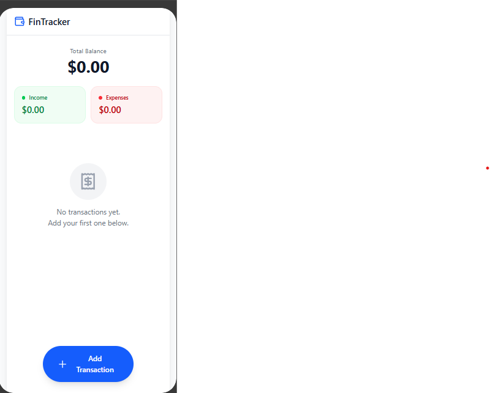
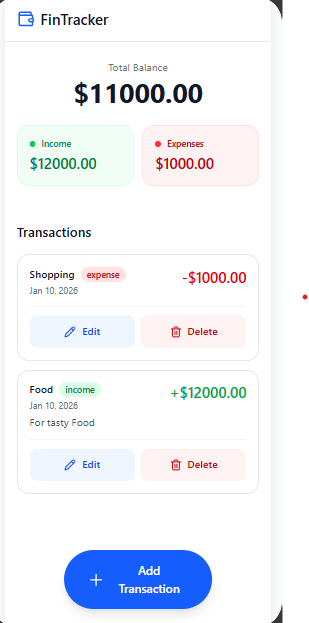
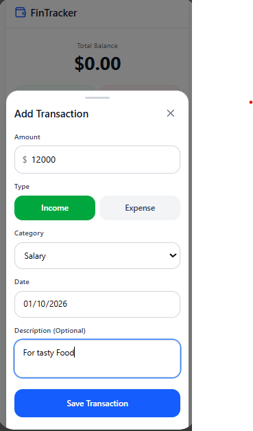
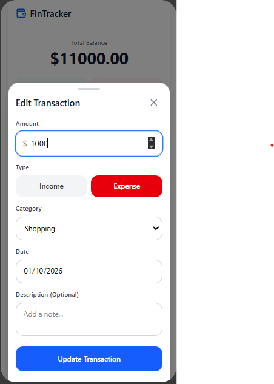

# FinTrack Local-First

> Offline-first personal finance tracker built with modern JavaScript and IndexedDB
---

## Why this project?

Most junior projects rely on APIs and online backends.  
With **FinTrack Local-First**, the goal was to explore a **local-first architecture** and understand how real-world applications can work **fast, offline, and privacy-friendly**.

This project emphasizes:

- clean JavaScript architecture
- asynchronous data handling
- MVP-driven development

---

## Key Features (MVP)

- Offline-first data persistence using **IndexedDB**
- Full **CRUD** operations for income and expenses
- Automatic balance, income, and expense calculations
- Data survives browser refresh and restart
- Mobile-first user experience

> Focus: **functionality and architecture before visuals**

---

## Screenshots

> Screenshots reflect the MVP stage (functionality-first approach and mobile-first).

### Dashboard

### Transactions Management

### Add / Edit Transaction

---

## Technical Stack

- **HTML5** – semantic and accessible markup
- **Tailwind CSS** – utility-first styling
- **JavaScript (ES6+)** – modular and asynchronous
- **IndexedDB** – client-side database (idb)
- **Charts** – Chart.js or ApexCharts (planned)

---

> This separation improves maintainability and scalability.

---

## Data Model (IndexedDB)

| Field      | Type             | Description             |
|------------|------------------|-------------------------|
| id         | UUID / Timestamp | Primary key             |
| label      | String           | Transaction name        |
| amount     | Number           | Income (+) / Expense (−)|
| category   | String           | Category tag            | -->
| date       | ISO String       | Transaction date        |

---

## Development Approach

- **MVP-first**: stable core before enhancements
- **Offline-first**: no backend dependency
- **Clean separation of concerns**
- Progressive enhancements after validation

---

## Challenges & Learnings

- Working with **IndexedDB and async flows**
- Structuring a JavaScript project beyond a single file
- Thinking in terms of product, not just features

---

## Future Improvements

- Monthly budget tracking
- JSON import/export with conflict handling
- Charts and data visualization
- Progressive Web App (PWA)

---

## Getting Started

